# Logo Detection with YOLO
This work was done for Santa Clara University's Computer Vision course taught by Professor Weber

## Introduction

 We trained two state-of-the-art computer vision architectures, YOLOv4 and YOLOv5, on two publicly available datasets and a custom built dataset curated using Google Vision. **Using Mean Average Precision (mAP) as our performance metric, we verified previous research conclusions that additional training data improves performance and found that YOLOv5 in all test cases was the superior model.** 

YOLOv4 model found **[here](https://github.com/AlexeyAB/darknet)**

YOLOv5 model found **[here](https://github.com/ultralytics/yolov5)**

<p align="center">
  Example GIFs of logo detection on videos 
</p>


## Problem Statement
Logo detection has been gaining considerable attention because of its wide range of applications in the multimedia field such as copyright infringement detection, brand visibility monitoring, and product brand management on social media. In [2019 the European Union announced](https://www.bbc.com/news/technology-47708144.amp) new laws that hold technology companies responsible for material posted without proper copyright permission. In addition to this, a paper published in 2015 through the [ASPIRE Laboratory at UC Berkeley](https://arxiv.org/abs/1510.02131) reported that ad networks often don’t know what is in the ad JPEG that they are placing in front of web content. Therefore, for example, a Toyota advertisement might not get placed with relevant information such as car-related content due to the lack of understanding the logo being used. From a computer vision perspective, this task is challenging for two primary reasons: there is no fixed number of company logos to classify and images of the logo itself tend to be a very small feature of the input image. Historically certain types of logo detection have been difficult for computer vision using traditional techniques such as keypoint methods like SIFT and corner detection. Such methods generally work best in images that are well textured, which is often not the case with some well-known logos like the Nike swoosh. Logos also come in different shapes and sizes, making classical algorithmic approaches ineffective. Within the last 10 years deep learning has found its way into this problem space, with researchers applying object classification and detection networks to publicly available logo datasets.

## Prior Research
Much of the logo detection research to date can be broken down into two categories: papers that release new datasets and papers that take a common vision framework and implement it on publicly available datasets. For example, [Deep Learning for Logo Recognition](https://www.sciencedirect.com/science/article/abs/pii/S0925231217305660?via%3Dihub) and [Open Logo Detection Challenge](https://arxiv.org/abs/1807.01964) are two papers that have curated new logo databases in an effort to expand the public domain. These provide vital resources for this problem statement as these datasets are expensive to create and subsequently are rarely open sourced. Other types of work such as [Deeplogo: Hitting logo recognition with the deep neural network hammer](https://arxiv.org/abs/1510.02131) and [Logo Recognition Using CNN Features](https://link.springer.com/chapter/10.1007/978-3-319-23234-8_41) build and analyze the suitability of detection networks on existing datasets. A paper released in 2020 titled [LogoDet-3K: A Large-Scale Image Dataset for Logo Detection](https://arxiv.org/abs/2008.05359) was able to accomplish both, showing that a custom network with a large scale dataset was able to achieve state of the art performance. The authors built a custom network derived from the YOLO architecture called Logo-Yolo and ran it on two common datasets. They found the standalone performance to be better than previous baselines but took it a step further and pre-trained on their own custom dataset, yet again, outperforming the model that was trained on a smaller subset. **While the model architecture is important, the datasets themselves appear to heavily influence performance - It is this takeaway that guided the effort of this project.**

## Models
One of the first single shot detectors published was YOLO, released in a paper titled [You only
look once: Unified, real-time object detection](https://arxiv.org/abs/1506.02640). While prior work repurposed classifiers to perform object detection, YOLO framed it as a regression problem to spatially separate bounding boxes and associated class probabilities. As a result, the whole detection pipeline is a single network and therefore was capable of being optimized end-to-end directly on detection performance. An added benefit was that the unified architecture enabled real-time detection in conjunction with improved performance. Since its release in 2016, there have been several improvements upon the original architecture, each of which has increased the performance and inference time.

### [YOLOv4](https://arxiv.org/abs/2004.10934)
Published in April of 2020, YOLOv4 improves [YOLOv3](https://arxiv.org/abs/1804.02767) with a 10% and 12% improvement on AP and FPS respectively when run on the [MS COCO Object Detection dataset](https://cocodataset.org/#home). This is accomplished through two architecture improvements: addition of new features and optimization for parallel computations. Of the new features added, a new method for data augmentation called Mosaic and Self-Adversarial Training (SAT) provide the largest performance improvement. Mosaic stitches together four training images, allowing detection of objects outside their normal context and reducing the need for a large mini-batch size. SAT on the other hand is a two stage data augmentation technique that modifies the neural network so that it executes an adversarial attack on itself, effectively reducing the effect of overfitting.

### [YOLOv5](https://github.com/ultralytics/yolov5)
Open-sourced by a company called [Ultralytics](https://ultralytics.com/), there is an open debate online as to whether this repository is an improvement upon YOLOv4 or merely a spin off using a different backend. The company claims that the model runs faster than YOLOv4 and boasts that it “incorporates lessons learned and best practices evolved over thousands of hours of training and evolution on anonymized client datasets”. Upon evaluation of both models, what is clear is that YOLOv5 is much more user friendly but at the expense of less control of finer model details.
 
## Datasets

<p align="center">

| Dataset                   | Number of Images | Number of classes |
|:-------------------------:| :---------------:| :----------------:|
| FlickrLogos32             | 1280             | 32                |
| OpenLogo                  | 27,083           | 352*              |
| Custom Dataset (gVision)  | 3332             | 5                 |

</p>

\* We only used 32 of the 352 classes when training with the dataset standalone and 5 of them when combining with gVision.  

### **[FlickrLogos32](https://www.uni-augsburg.de/en/fakultaet/fai/informatik/prof/mmc/research/datensatze/flickrlogos/)**
Curated by the University of Augsburg, this dataset is a collection of images created for the evaluation of logo retrieval and logo detection over multiple classes. It consists of 32 different logo classes, each class representing a different and well recognized brand or company. All 1280 images were used for training.

<p align="center">
  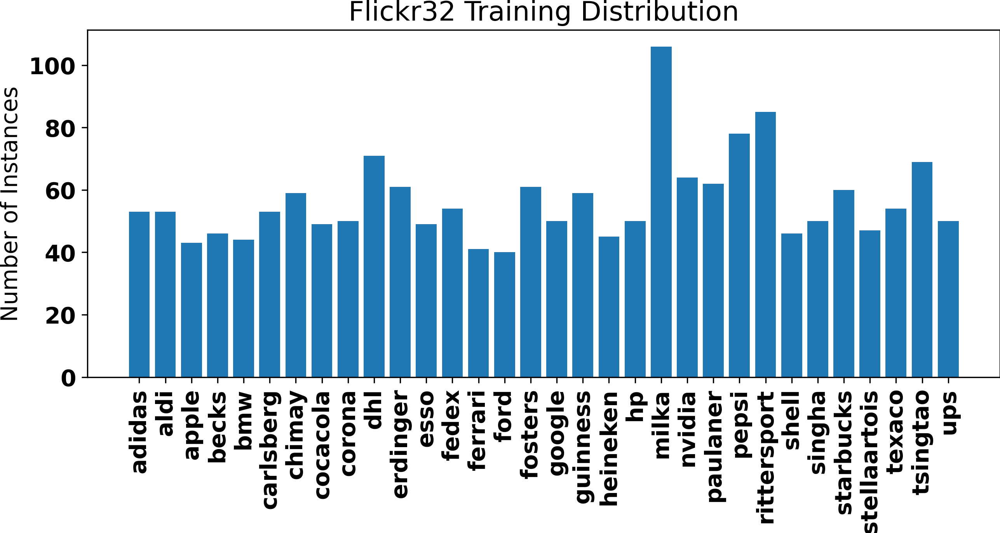
</p>

### **[OpenLogo](https://qmul-openlogo.github.io/)**
Developed by the [Computer Vision Group at Queen Mary University of London](http://vision.eecs.qmul.ac.uk/), this dataset was designed to serve as a more realistic and challenging logo detection benchmark. The authors note that prior datasets tend to make unrealistic assumptions about the deployment of logo detection networks and therefore fail to evaluate the true performance of the models in the wild. To address this, the authors combine seven different open-source datasets together for a total of ~27k images with 352 classes. Given the scale of this dataset, the number of classes had to be cut back in order to fit within the time and resource budget we had available. Since Flickr32 was a subset of this dataset, all 32 labels were extracted and used for training, resulting in ~8k training images total. Note that there is not an even number of images per class given that the original dataset is a combination of various other datasets.

<p align="center">
  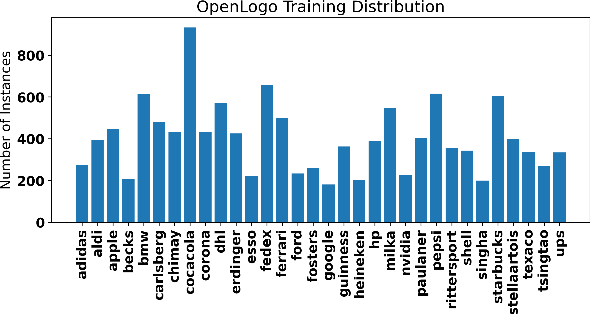
</p>

### **[Custom Dataset made using Google Vision](./data/gvision/)**
We created a custom dataset using the Google Vision API. Due to time constraints, we chose 5 popular brands that were represented in both the FlickrLogos32 and OpenLogo datasets. The process for creating this dataset involved using a number of open source tools. Images were first downloaded from Google Images using the [Image Downloader Chrome Extension](https://chrome.google.com/webstore/category/extensions) that can be found through the Chrome Webstore. Image Downloader is a browser extension that, for a given webpage, will download all the images on the page. Using this extension, several thousand search results from Google Images were downloaded for the five classes. Because Google Images can be very noisy in their relevance or often the same image appears multiple times, we can end up with two problems. The first problem is that of duplicates in the data, and the second is that Google Images may return search results that don’t contain the logo of interest. Duplicates in the data are bad for training because the duplicates introduce bias in the dataset. They give the network additional opportunities to learn patterns in the training dataset which ultimately means it could hurt the model’s ability to generalize on new data outside the training set. To handle the issue with duplicates, we used Perceptual Hashing (pHash).

Perceptual Hashing is a highly effective, straightforward, and computational efficient method for finding duplicates in visual data. It is a type of non-cryptographic hashing that maintains correlation between the input data and the output hash, therefore allowing comparison between inputs by comparing output hashes. First, image size is reduced to remove high frequency information from the data. Next the color space is reduced to grayscale, and then a discrete cosine transform is computed and only the lowest frequencies are kept to further reduce high frequency content of the image. An average is computed from the resulting values, and a hash is constructed by comparing each value in the image to the average. A bit is set to 0 or 1 depending if it falls above or below the average. If the overall content of two images are the same, then the hashes will also be the same, regardless of scale, adjustments to the color or gamma histograms, etc. Due to the non-random structure of the hash the Hamming distance between hashes can be compared to determine similarity. To find duplicates we used the [Python package ‘imagededup’](https://idealo.github.io/imagededup/). Imagededup contains several state of the art hashing algorithms, including an efficient implementation of pHash.

The second issue, eliminating images that were not relevant to the classes of interest, was addressed by using Google’s Vision API. Google Vision API provides high quality logo detection that returns bounding boxes for several hundred logo classes. By processing each of the thousands of images downloaded from Google Images and treating them as possibilities, the API returns the bounding boxes for the classes it finds. Keeping images that return bounding box data with a high score effectively does the job of eliminating non relevant images, in addition to providing the bounding box information needed for training.

<p align="center">
  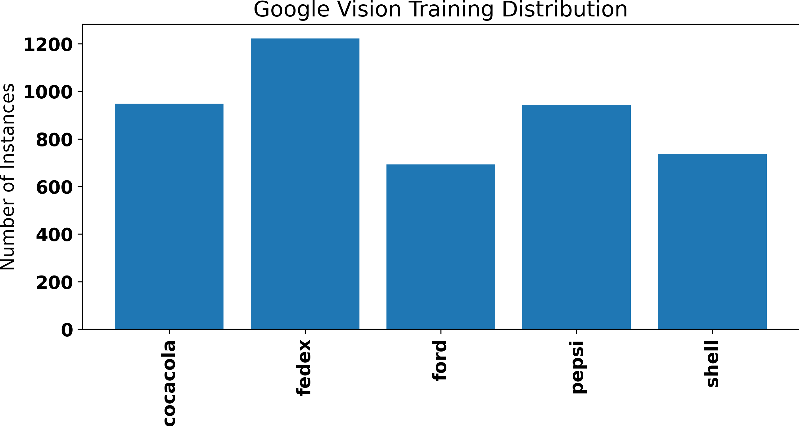
</p>

## Performance Metrics
MEAN AVERAGE PRECISION (mAP) 

To determine model performance on each dataset, the Mean Average Precision (mAP) was calculated on the respective validation set. For detection, a common way to determine if an object proposal is correct is to measure the corresponding Intersection over Union (IOU). This is defined as the area of overlap divided by the area of union of the ground truth bounding box and the predicted bounding box. Formally defined in the equation below
<p align="center">
  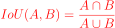
</p>

We set the threshold at 0.5, meaning that an IoU of > 0.5 was considered a hit, otherwise it was a failure. Each hit is recorded and then the average precision for class c is calculated with the following formula below such that TP is a True Positive and FP is a False Positive
<p align="center">
  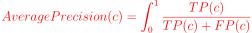
</p>

The mAP is then simply the mean of each average precision, formally denoted below.
<p align="center">
  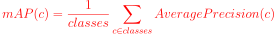
</p>

## Training
We trained a total of 10 models for comparison. 5 models were trained using YOLOv4 on an Nvidia GTX 1080 which uses the Darknet framework, and 5 models were trained using YOLOv5 on the Santa Clara University High-Performance-Computer using an NVIDIA V100. As recommended in the YOLOv4 documentation, each model was trained for iterations equaling 2000 x (# of classes). In the case of FlickrLogos32 and OpenLogo this works out to 3200 epochs and 512 epochs respectively. For the remaining models (where 5 classes were trained for), the models were trained for approximately 180 epochs each. In all cases the default optimization strategy was used, which was a polynomial decay learning rate of 0.005 with an initial learning rate of 0.001 and momentum of 0.949. YOLOv5 was trained with the default fine-tuning hyperparameters, with each model trained for 100 epochs. However, we found the model to converge after ~30 epochs, with validation performance flatlining thereafter. The framework also offers many different hyperparameters that can be set but the most notable were the learning rate at 0.0032, momentum at 0.843, and weight decay at 0.00036.

The validation set used in all experiments comes from the validation set provided in the OpenLogo dataset. Our first two experiments had 32 classes with ~3.4k images. Our last three experiments used a subset of the 32-class validation, resulting in 658 validation images. We did this to provide a fair way to compare the Average Precision on a class-by-class basis.

<p align="center">
    YOLOv4 OpenLogo (32 class) loss curve
</p>
<p align="center">  
    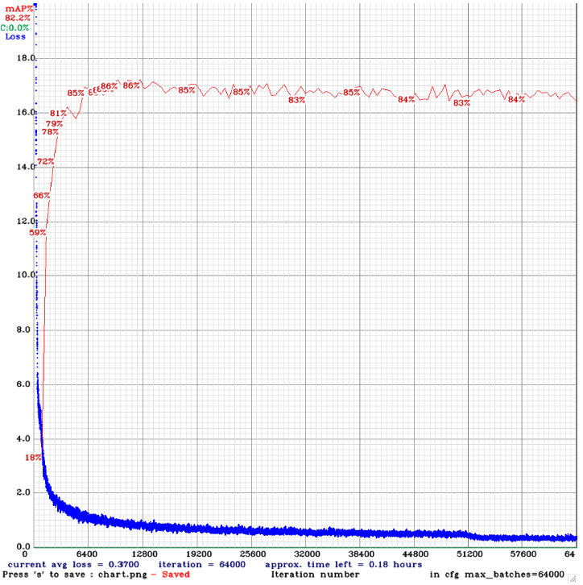
</p>

<p align="center">
    YOLOv5 OpenLogo (32 class) loss curve
</p>
<p align="center">  
    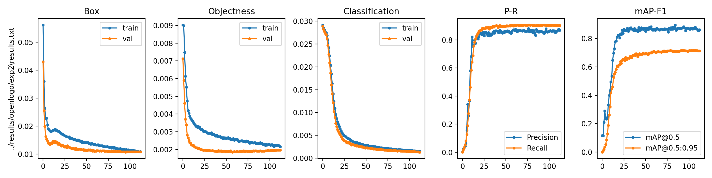
</p>

## Validation Dataset
The validation set used in all experiments comes from the validation set provided in the OpenLogo dataset. Our first two experiments had 32 classes with ~3.4k images. Our last three experiments used a subset of the 32-class validation, resulting in 658 validation images. We did this to provide a fair way to compare the Average Precision on a class-by-class basis.

<p align="center">
    Validation Distribution when training with 32 classes
</p>
<p align="center">  
    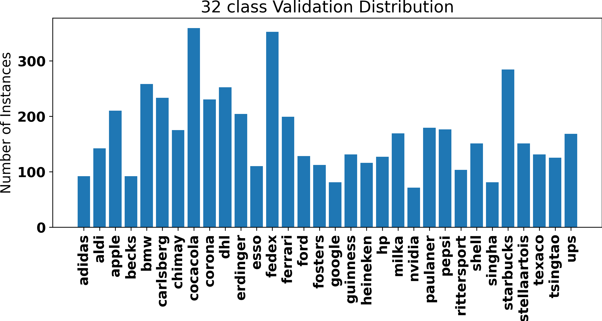
</p>

<p align="center">
    Validation Distribution when training with 5 classes
</p>
<p align="center">  
    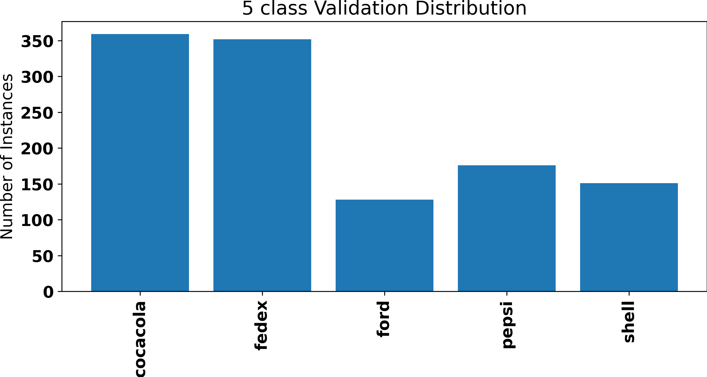
</p>


## Results

<p align="center">

| Dataset                   | Num. of Classes | Num. of Training Images | YOLOv4 mAP @ 0.5 | YOLOv4 mAP @ 0.5 |
|:-------------------------:| :-------------: | :---------------------: | :--------------: | :--------------: |
| FlickrLogos32             | 32              | 1280                    | 0.645            | 0.763            |
| OpenLogo                  | 32              | 8010                    | 0.861            | 0.901            |
| Custom Dataset (gVision)  | 5               | 3332                    | 0.516            | 0.651            |
| gVision w/ FlickrLogos32  | 5               | 3532                    | 0.681            | 0.771            |
| gVision w/ OpenLogo       | 5               | 4862                    | 0.821            | 0.869            |

</p>

While the architecture differences between YOLOv4 and YOLOv5 remain vague at best, we found that YOLOv5 outperformed YOLOv4 in every test case. We believe the reason for this is the optimization of the hyperparameter choices that YOLOv5 is defaulted with.  

Based on our observations from previous research papers, we anticipated that as we increased the training data, our mAP would increase. We found this to be the case with the exception for our custom dataset. FlickrLogos32 and Openlogo on average contain 40 and 250 images per class, respectively, while in contrast our custom dataset contains approximately 670 images per class. After looking into this, we concluded that on a per class basis the custom dataset had superior results in all cases except for Pepsi, for which the AP was significantly lower.

<p align="center">
    Average Precision for FlickrLogos32 and gVision
</p>
<p align="center">  
    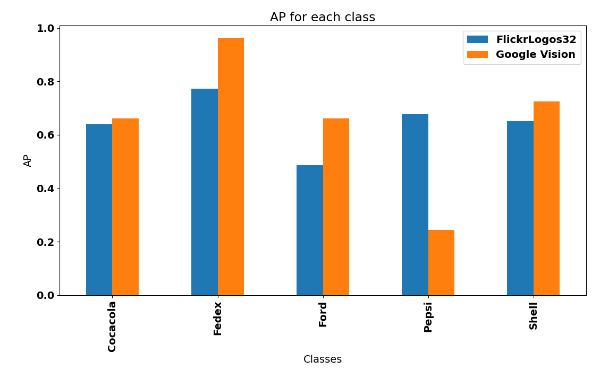
</p>

We believe the problem was the training images contain several versions of Pepsi’s logo, spanning several decades. The OpenLogo validation dataset consisted of images from just the most recent Pepsi logo, so it is likely the network was unable to generalize well for the Pepsi class. We suspect that further cleaning of this dataset would significantly improve the average precision.

<p align="center">  
    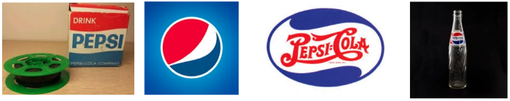
</p>
<p align="center">
    Different Pepsi logo styles collected for the custom dataset
</p>

## Conclusion

Through our research of current logo detection algorithms, we concluded that many papers choose to release their own datasets in addition to training common vision frameworks on publicly available datasets. In particular, state-of-the-art models are a derivative of the YOLO architecture. In light of this information, we chose to train YOLOv4 and YOLOv5 on two publicly available datasets and a custom built dataset curated using Google Vision. **In doing this we verified previous research conclusions that additional training data improves performance and found that YOLOv5 in all test cases was the superior model. We discovered that the model is sensitive to noise, suggesting that only one style of logo should be used per class and that the models are not as sensitive to image size as we initially anticipated.** We believe that identifying better criteria for training images will also help boost performance. Since logos in the wild are pulled from films, commercials, sports events, etc, using these types of images for training should help the model generalize better.

## Usage

The original logo datasets did not come in the appropriate format for training. The YOLO architectures want the box labels to be in the form of 
```python
    <object-class> <x_center> <y_center> <width> <height>
```
whereas the formats came in the format of 
```python
    <object-class> <xmin> <xmax> <ymin> <ymax>
```
The data we have added to this repository comes in the proper format but we have added the python scripts used to modify the box labels. Scripts found [here](./src/flickrlogos2darknet.py) and [here](./src/openlogos2darknet.py)

Training YOLOv4

To train on the logo datasets, a pre-trained weights file should be used. A configuration file then needs to be altered to adjust the number of classes, batch size, directory locations, and various other YOLO specific settings. A detailed explanation of how to do this can be found [here](./src/yolov4_model/darknet/README.md#how-to-train-to-detect-your-custom-objects). Once this is setup the model can be trained by running the following bash script (variables may be different)

```sh
./src/yolov4_model/darknet/darknet detector train data/obj.data yolo-obj.cfg yolov4.conv.137 
```
Training YOLOv5

To train on the logo datasets, a pretrained model should be picked as a starting point. Different sizes are offered, we chose to use YOLOv5x which is the x-large model. For a detailed explanation of how to setup the script, check the YOLOv5 wiki page found [here](https://github.com/ultralytics/yolov5/wiki/Train-Custom-Data). Once the model is setup it can be trained by running the following command inside ./src/yolov5_model/

```sh
python train.py --img 640 --batch 16 --epochs 3 --data coco128.yaml --weights yolov5s.pt
```

Displaying results

We included several scripts used to generate bar plots for both the data and model results. These scripts can be found [here](./src/)